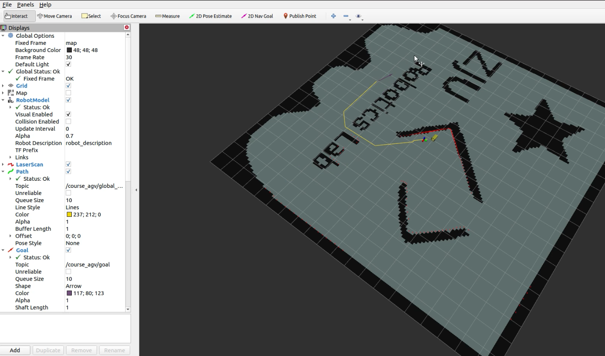
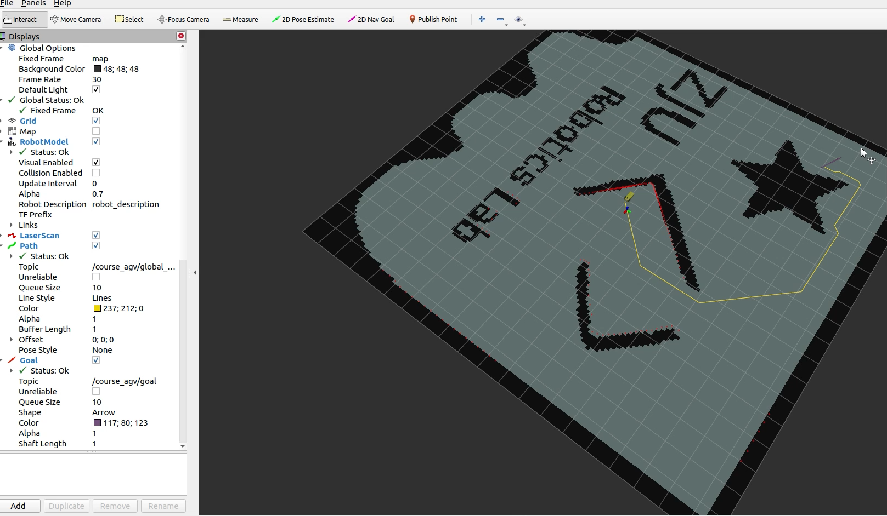

# robot_nav
**Read this in other languages: [English](README.md), [中文](README_zh.md).**

A course project for motion control simulation of a mobile robot

## Introduction

The static map of this project has been given, we need to complete the kinematics (getting the speed of two wheels after knowing the v,w), TF message sending, global path planning and trajectory tracking. 

In the project, I completed the global path planning through A\*, JPS, RRT\* methods, and track the intermediate path points using the plain and DWA methods after selecting the intermediate points.

## Usage

Compile the workspace and run the following command: `roslaunch course_agv_nav nav.launch`

