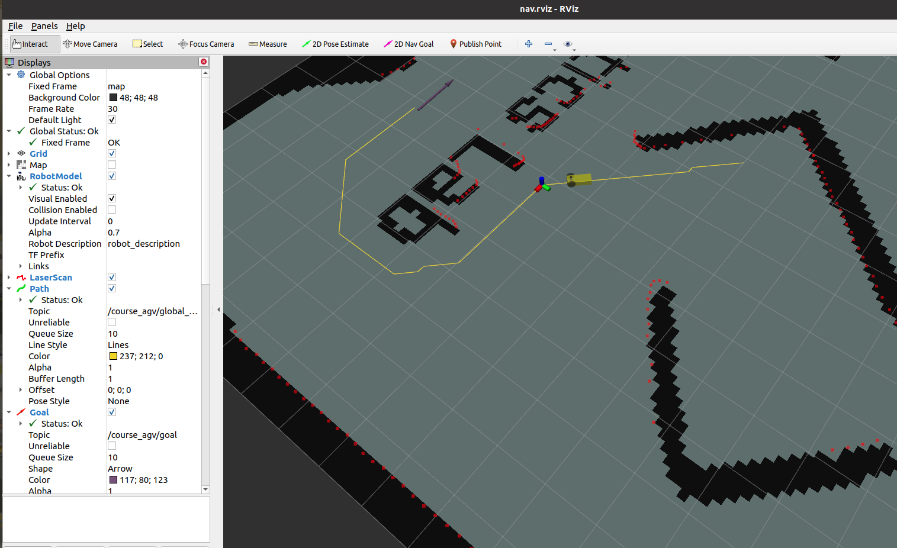

# robot_nav
mobile robot practice in ZJU 

浙江大学 2023年短学期《机器人与智能系统综合实践》 

移动机器人运动控制仿真

## 介绍

本项目的静态地图已经给出，需要完成运动学（已知vw后得到双轮转速）、tf消息发送、全局路径规划和轨迹跟踪。本人完成A*、JPS方法实现的全局路径规划，简单选取中间路径点后，使用朴素方法和DWA方法跟踪中间路径点。

## 使用方法

编译后运行 `roslaunch course_agv_nav nav.launch`

